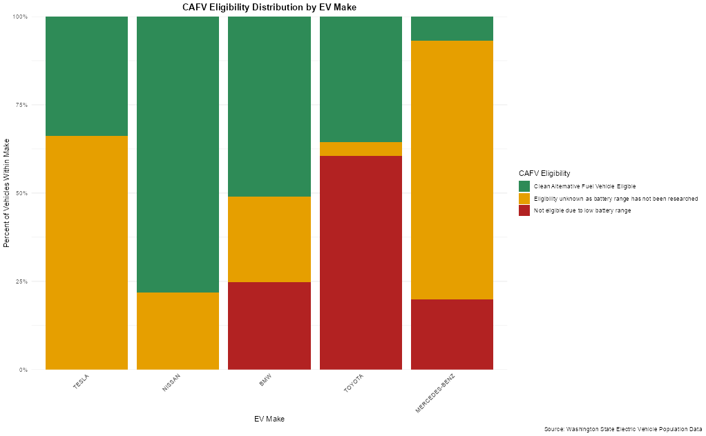
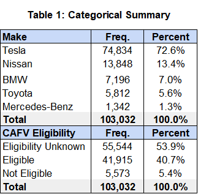
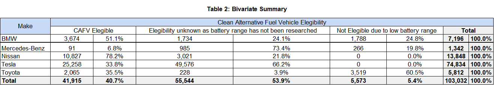

# EV Make and CAFV Eligibility Analysis

This project examines whether Clean Alternative Fuel Vehicle (CAFV) eligibility differs across selected electric vehicle (EV) manufacturers registered in Washington State.

Using the Washington State Electric Vehicle Population Data, the analysis focuses on five manufacturers: Tesla, Nissan, BMW, Toyota, and Mercedes-Benz. It combines descriptive statistics, a chi-square test of independence, Cramér's V, and a 100% stacked bar chart to assess the relationship between EV make and CAFV eligibility.

## Research Questions

1. Do selected EV manufacturers differ in the proportion of vehicles that qualify for CAFV incentives?
2. Is there a statistically significant association between EV make and CAFV eligibility?

## Data Source

The analysis uses the [Washington State Electric Vehicle Population Data](https://data.wa.gov/Transportation/Electric-Vehicle-Population-Data/f6w7-q2d2), published by the Washington State Department of Licensing.

The analytic sample includes vehicles registered under the following manufacturers:

- Tesla
- Nissan
- BMW
- Toyota
- Mercedes-Benz

The final analytic sample contains 103,032 vehicle records.

## Methods

The analysis includes:

- Univariate frequency and percentage summaries for EV make and CAFV eligibility.
- A bivariate contingency table of EV make by CAFV eligibility.
- A Pearson chi-square test of independence using a significance level of 0.01.
- Cramér's V to quantify the strength of association between the categorical variables.
- A 100% stacked bar chart to compare CAFV eligibility distributions within each manufacturer.

CAFV eligibility is categorized as:

- Clean Alternative Fuel Vehicle Eligible
- Eligibility unknown as battery range has not been researched
- Not eligible due to low battery range

## Key Findings

- EV make and CAFV eligibility are statistically associated: $\chi^2(8, N = 103{,}032) = 58{,}018$, $p < .01$.
- The association is strong, with Cramér's \( V = 0.53 \).
- Nissan had the highest share of CAFV-eligible vehicles among the selected manufacturers, at 78.2%.
- Tesla represented 72.6% of the selected-manufacturer sample; however, 66.2% of Tesla records had unknown CAFV eligibility.
- Toyota had the highest share of vehicles classified as not eligible due to low battery range, at 60.5%.
- More than half of the total analytic sample had unknown CAFV eligibility, emphasizing limitations in the underlying eligibility information.

## Repository Structure

```text
.
├── code/
│   └── ev_cafv_analysis.R
├── data/
│   └── electric_vehicle_population_data.csv
├── outputs/
│   ├── figures/
│   │   └── cafv_eligibility_by_ev_make.png
│   └── tables/
│       ├── table_1_univariate_ev_make_cafv_summary.png
│       └── table_2_ev_make_cafv_eligibility_summary.png
├── report/
│   ├── washington_ev_cafv_eligibility_report.docx
│   └── washington_ev_cafv_eligibility_report.pdf
└── README.md
```

## Reproducing the Analysis

### Requirements

The analysis was conducted in R and requires the following packages:

```r
install.packages(c(
  "DescTools",
  "dplyr",
  "ggplot2",
  "janitor",
  "scales"
))
```

### Steps

1. Clone or download this repository.
2. Open `code/ev_cafv_analysis.R` in RStudio, Positron, or another R-compatible IDE.
3. Ensure `electric_vehicle_population_data.csv` is located in the `data/` folder.
4. Update the file-import path in the script if needed.
5. Run the script from start to finish.
6. Review the generated summaries, chi-square test results, figure, and formatted table.

## Outputs

### Figure



*Figure 1. CAFV eligibility distribution within each selected EV make. Percentages within each manufacturer sum to 100%.*

### Tables

#### Table 1. Categorical Summary



*Frequency and percentage distributions for the five selected EV makes and CAFV eligibility categories.*

#### Table 2. CAFV Eligibility by EV Make



*Counts and within-make percentages for CAFV eligibility across Tesla, Nissan, BMW, Toyota, and Mercedes-Benz.*

## Limitations

- The selected five manufacturers were chosen for project focus rather than by the five most frequent makes in the full dataset.
- Tesla accounts for a large share of the analytic sample, which may influence overall results and comparisons.
- CAFV eligibility is unknown for a substantial share of vehicles, limiting interpretation of actual incentive qualification.
- The analysis evaluates association and does not establish that manufacturer choice causes CAFV eligibility.

## Author

Francisco Rezzonico

## References

Washington State Department of Licensing. (2025). *Electric Vehicle Population Data*. Washington State Open Data Portal. https://data.wa.gov/Transportation/Electric-Vehicle-Population-Data/f6w7-q2d2
